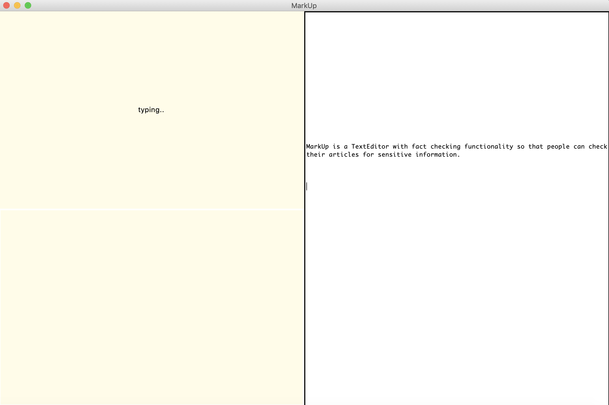
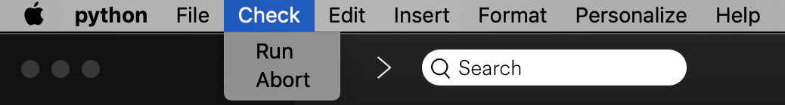
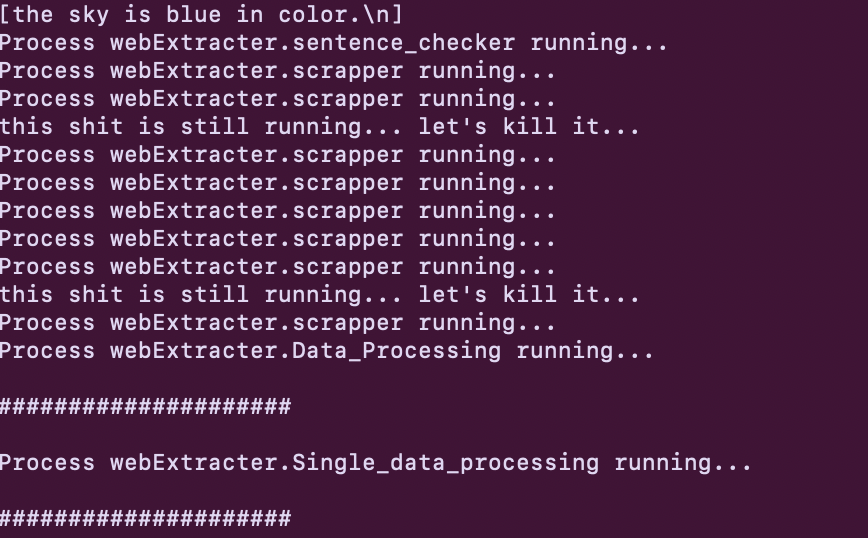

# Markup
Markup is a TextEditor which has in built Fact Checking features. The project was inspired by the Fake News Project which I have worked with along with the BBC. 

The following is written in python2.7. The Following is still in developing functionality, however a prototype can be run at `archives\prototype.py`.

In order to deploy, clone the following repository to your local machine and change to the directory. Then run the following command
```
pipenv install --dev
```





### Features

The following TextEditor has the following functionality
- Opening and Saving, which means other text files can be open in this text editor in order to use fact checking facilities in it.
- MarkUp has all basic formatting options, which means you won't miss on the essentials of Text Editting.
- Fact Checking functionality the main feature if this project 





### Improvements

- Shifting UI to JavaScript or to Qt
- Being able to incorporate databases so that personal information can be added as verifiers.
- Better features as a regular Text Editor can be added


### UI

MarkUp is divided into 3 panes. 
- The first pain, is the **Console** pane, on the top left. 
- The second pane, which is towards the right is **Main Pane**. This is where the users writes his/her articles.
- The third pane is called the **try** pane. Thix where the user can write his/her notes. for his/her reference.

### Fact Checking

The Fact checking algorithm works by identifying key parts of the document, you have written and run two checks parallely

- The first check is running a check with online resources by comparing it with a list of resources which the editor picks, which it feels is close to the given key points. It does that by checking the validity of resources it has and returns a score to the editor's core engine.

- The Second check is sentences semantics checkers, where machine learning is used to see if sentences structure and other key points from the article give a key idea of it's genuinity. This too returns a score to the engine. 

- Finally both of them combined give a combine score. 

- In order to double check, the engine stores resources which it has used for checking and provides it to the user, so that he can crosscheck manually.





### Core Engine

MarkUp's core engine uses multithreading in order to speed up processes, and thus can run multiple fact checkers at the same time. 

A large number of Natural Language Processing algorithms such as PageRank, TextRank and word embeddings are implemented in order to analyse Text in articles, without saving it thus guaranteeing data privacy. 


Contributions are most welcome to the repository!


